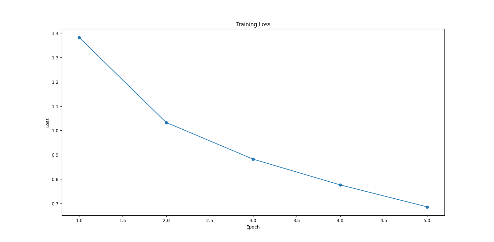

# Image Classification with PyTorch - CIFAR-10 Dataset

## Overview
This project implements a simple Convolutional Neural Network (CNN) to classify images from the CIFAR-10 dataset into 10 categories, such as airplanes, cars, birds, and animals. The model is built using PyTorch and achieves a reasonable accuracy with a basic architecture.

---

## Dataset
The **CIFAR-10** dataset consists of 60,000 32x32 color images in 10 classes, with 6,000 images per class:
- **Training Set**: 50,000 images
- **Test Set**: 10,000 images

### Classes:
- Airplane
- Automobile
- Bird
- Cat
- Deer
- Dog
- Frog
- Horse
- Ship
- Truck

---

## Technologies Used
- **Programming Language**: Python
- **Framework**: PyTorch
- **Libraries**:
  - Torchvision for dataset and transformations
  - Matplotlib for visualizations

---

## Project Structure
```plaintext
Image-Classification-with-PyTorch---CIFAR-10/
├── src/
│   ├── train.py            # Training and evaluation script
│   ├── test_model.py       # Unit tests for model components
├── requirements.txt        # Dependencies
├── README.md               # Project documentation
├── .gitignore              # Files to ignore in the repository
├── plot/
│   ├── training_loss.png   # Training loss visualization


Results
Training Loss
The model was trained for 5 epochs, achieving consistent loss reduction:

Epoch	Training Loss
1		1.36
2		1.01
3		0.87
4		0.77
5		0.69
Test Accuracy
The model achieved 70.24% accuracy on the CIFAR-10 test dataset.

### Visualization
Training loss over epochs:



How to Run
1. Clone the Repository


	git clone https://github.com/himanshu-dandle/Image-Classification-with-PyTorch---CIFAR-10.git
	cd Image-Classification-with-PyTorch---CIFAR-10
2. Set Up the Environment
	Create and activate a virtual environment:
	python -m venv venv

venv\Scripts\activate  # On Windows
3. Install Dependencies


pip install -r requirements.txt
4. Train the Model
	Run the training script:
		python src/train.py
	
5. Evaluate Results
	The script will display:

	Training loss per epoch
	Test accuracy
	Testing
	The project includes unit tests to verify key functionalities:

	Data Loading: Ensures that the CIFAR-10 dataset is loaded with the correct input and label shapes.
	Model Output: Verifies that the model produces outputs of the expected shape for given input dimensions.
	How to Run Tests
	Run the test script to ensure everything is working:


python src/test_model.py
Test Results
Data Loading: Passed ✅
Model Output: Passed ✅
All tests passed successfully, confirming the integrity of the data pipeline and model implementation.

Future Work Enhancements:

Architecture Improvements:
	Add more convolutional layers or use advanced architectures like ResNet.
	Fine-tune pretrained models for improved accuracy.
	
Data Augmentation:
	Use random cropping, rotation, and flipping to improve generalization.
	
Hyperparameter Tuning:
	Experiment with learning rates, batch sizes, and optimizers.

Additional Metrics:
	Compute precision, recall, F1-score, and confusion matrix for deeper insights.

